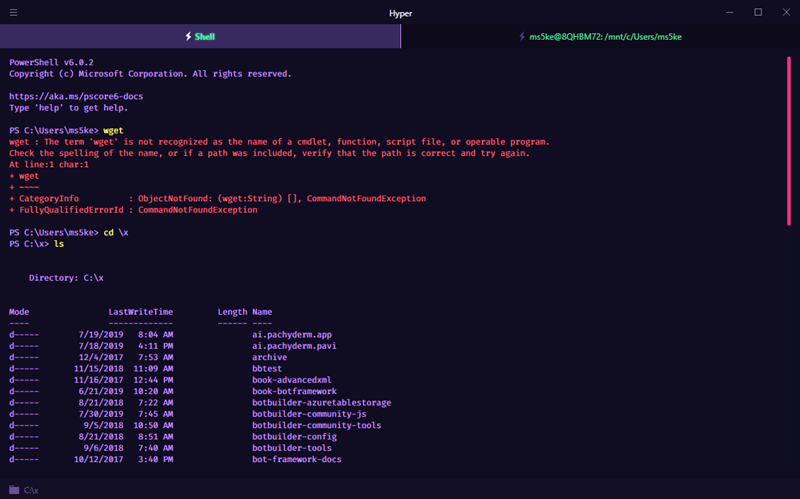
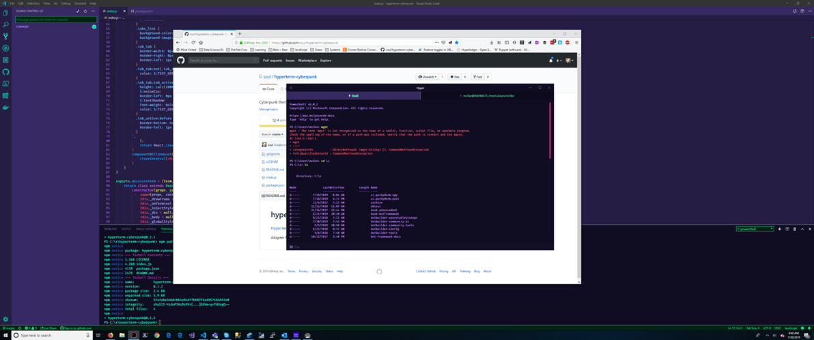

# hyper-cyberpunk

[Hyper](https://hyper.is) terminal cyberpunk theme inspired by the [Cyberpunk](https://github.com/prometheux-ar/cyberpunk) Visual Studio Code theme.

**Screenshot**

Adapted from the [hyperpunk](https://github.com/staltz/hyperpunk) theme.
